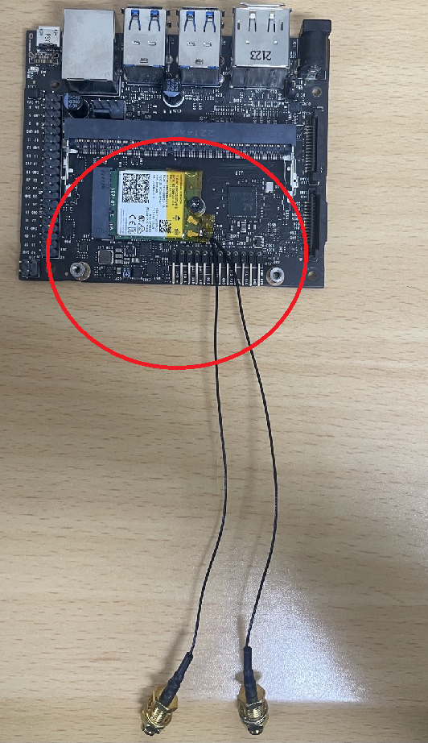
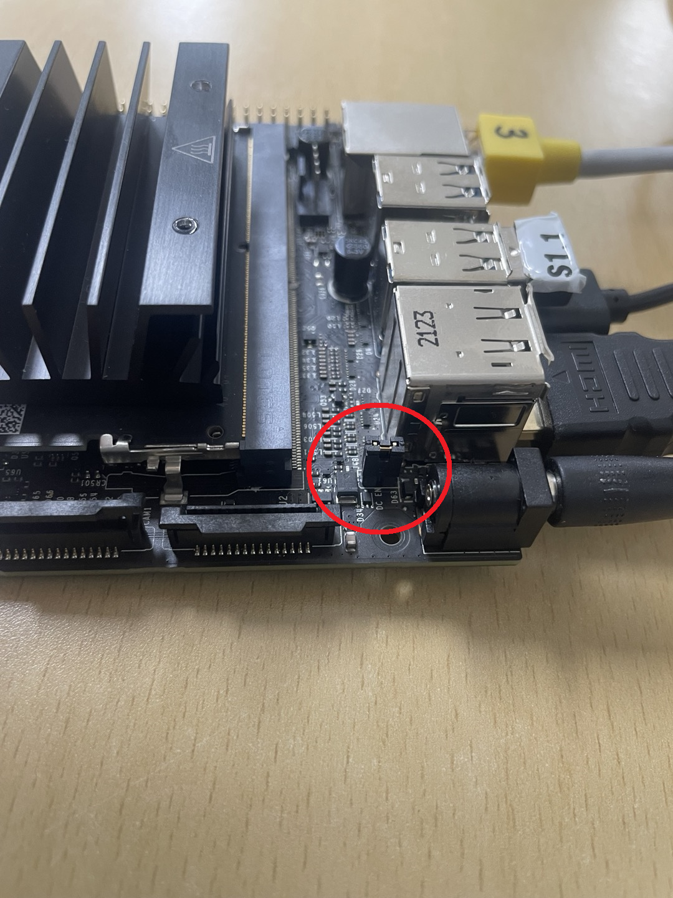

Board 세팅
==========

**목표:** Jetson-Nano Developer Kit Board를 세팅합니다.

사전준비
--------

1. WiFi 모듈과 안테나

2. Jetson-Nano Developer Board

3. 랜선, HDMI, SD카드, 키보드, 마우스, 스피커, 카메라, 전원 (5V/4A MAX)

4. 큰 드라이버, 작은 드라이버 각각 1개씩

Board 세팅
^^^^^^^^^^^^^^^^^^^^^^^^^^^^^^^^^^^

Jetson-Nano Board를 세팅합니다.

1. 와이파이 모듈 연결
~~~~~~~~~~~

와이파이 모듈을 연결합니다.
단, 와이파이 모듈의 선을 아래로 향하게 합니다.

2. 보드 연결
~~~~~~~~~~~

- SD 카드
- 전원선 (5V/4A)
- HDMI
- 키보드/마우스
- 스피커
- LAN 선

모두 연결합니다.

* 주의: 점퍼를 연결해야 전원선으로 전원공급 가능해진다.

화면이 나오면 세팅 시작합니다.

3. 보드 연결
~~~~~~~~~~~

- SD 카드
- 전원선 (5V/4A)
- HDMI
- 키보드/마우스
- 스피커
- LAN 선

모두 연결합니다.

* 주의: 점퍼를 연결해야 전원선으로 전원공급 가능해진다.

화면이 나오면 세팅 시작

4. 보드 연결
~~~~~~~~~~~

- SD 카드
- 전원선 (5V/4A)
- HDMI
- 키보드/마우스
- 스피커
- LAN 선

모두 연결합니다.

* 주의: 점퍼를 연결해야 전원선으로 전원공급 가능해진다.

화면이 나오면 세팅 시작

5. 보드 연결
~~~~~~~~~~~

- SD 카드
- 전원선 (5V/4A)
- HDMI
- 키보드/마우스
- 스피커
- LAN 선

모두 연결합니다.

* 주의: 점퍼를 연결해야 전원선으로 전원공급 가능해진다.

화면이 나오면 세팅 시작

6. 보드 연결
~~~~~~~~~~~

- SD 카드
- 전원선 (5V/4A)
- HDMI
- 키보드/마우스
- 스피커
- LAN 선

모두 연결합니다.

* 주의: 점퍼를 연결해야 전원선으로 전원공급 가능해진다.

화면이 나오면 세팅 시작

요약
-------

로봇을 사용하기 위해서 SD 카드에 우분투 OS를 설치하고 로봇의 ``WiFi`` 을 설정하는 작업을 완료했습니다.

또한 나중에 PC와의 연결을 위해 ``openssh-server`` 를 설치하고 로봇의 ``IP`` 를 확인하는 법을 배웠습니다.

다음 단계
----------

다음으론 좀 더 편리한 사용을 위해서 PC에서 로봇에 접속하고 로봇을 사용하는 방법을 학습하겠습니다.