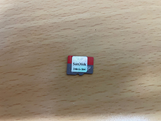
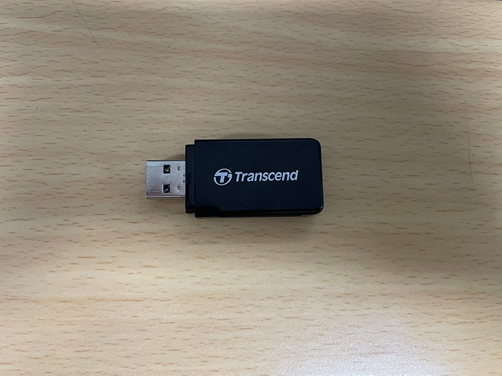
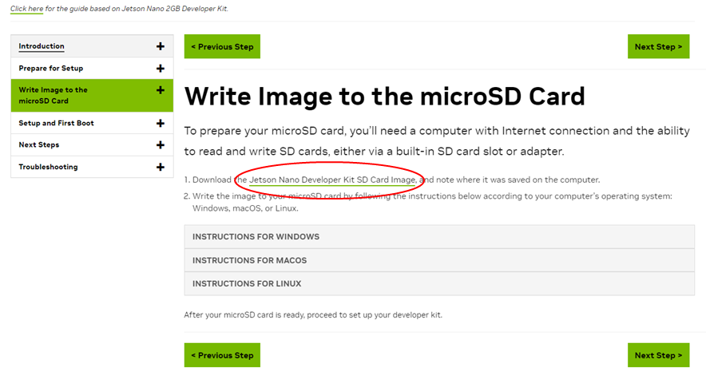
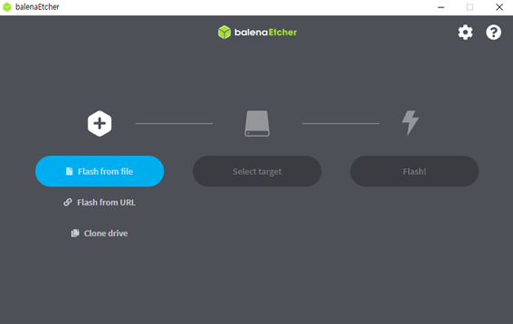
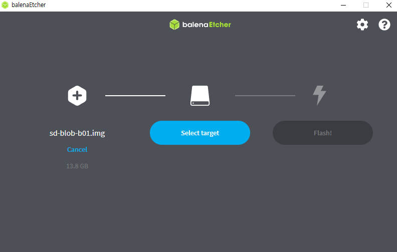
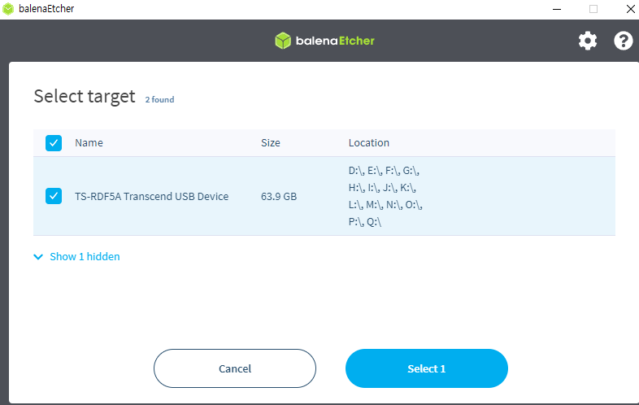
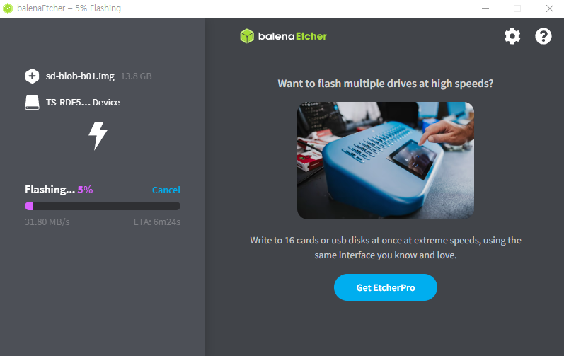
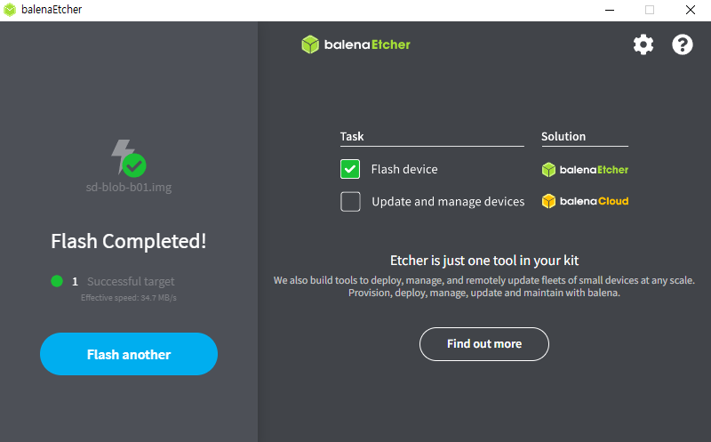

Jetson Nano 세팅
==================

**목표:** Jetson Nano 개발 Kit를 세팅한다.

준비물
---------------------

.. list-table::
    :header-rows: 1

    * - Product Picture
      - Product Description
    * - |part_1|
      - | SD card
    * - |part_2|
      - | SD card 리더기  

이미지 세팅
---------------------

두가지를 다운로드 해야한다.(Image/Etcher)

1. Jetson Nano의 Image 파일을 다운로드 (url: https://developer.nvidia.com/embedded/learn/get-started-jetson-nano-devkit#write)

2. Etcher 프로그램 다운로드 (url: https://etcher.balena.io/) - Portable 추천

이미지 Flash 
---------------------

1. Etcher 실행

2. Select Image

``jetson-nano-jp461-sd-card-image`` 파일을 압축을 해제하고, 파일 내부에 있는 이미지 파일을 선택한다.

.. image:: images/jetson_setting/image_file.png

    
3. Select Device

SD 카드를 리더기에 꽂고 PC에 연결한 다음에 선택한다.
(주의: 갑작스럽게 다수의 파일 탐색기들이 뜰 수 있지만, 괜찮다.)

4. Flash

모든 준비를 마쳤다면, Flash 버튼을 클릭한다.

.. image:: images/jetson_setting/flash.png

flash 작업을 시작한다.

5. Flash 완료

이제 SD card에 리더기를 통해서 Jetson-Nano image 파일이 쓰여졌다.

요약
-------

Jetson-Nano Developer Kit에 사용할 이미지 파일을 SD card에 업로드 했습니다. 
