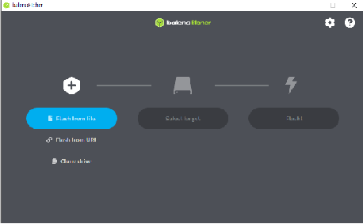
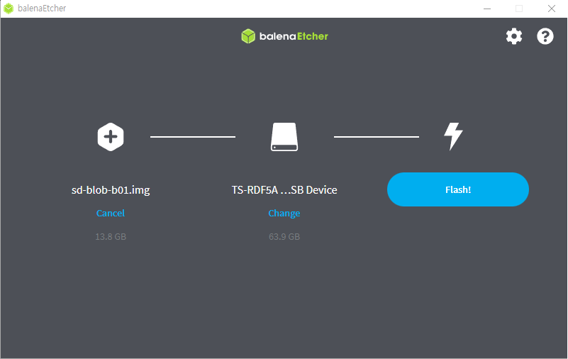

Jetson Nano 세팅
==================

**목표:** Jetson Nano 개발 Kit를 세팅한다.

사전준비
---------------------

1. Jetson-Nano Developer Kit
2. SD card / SD card 리더기

이미지 세팅
---------------------

1. Jetson Nano의 Image 파일을 다운
https://developer.nvidia.com/embedded/learn/get-started-jetson-nano-devkit#write

2. Etcher 프로그램 다운 (Portable 추천)

https://etcher.balena.io/

이미지 Flash 
---------------------

1. Etcher 실행

2. Select Image
Jetson Nano Developer kit Image zip 파일을 압축을 해제하고, 파일 내부에 있는 이미지 파일을 선택한다.

3. Select Device
SD 카드를 리더기에 꽂고 PC에 연결한 다음에 선택한다.
(주의: 갑작스럽게 다수의 파일 탐색기들이 뜰 수 있지만, 괜찮다.)

4. Flash
Flash 버튼을 클릭한다.

5. Flash 완료
이제 SD card에 리더기를 통해서 Jetson-Nano image 파일이 쓰여졌다.

요약
-------

Jetson-Nano Developer Kit에 사용할 이미지 파일을 SD card에 업로드 했습니다. 
