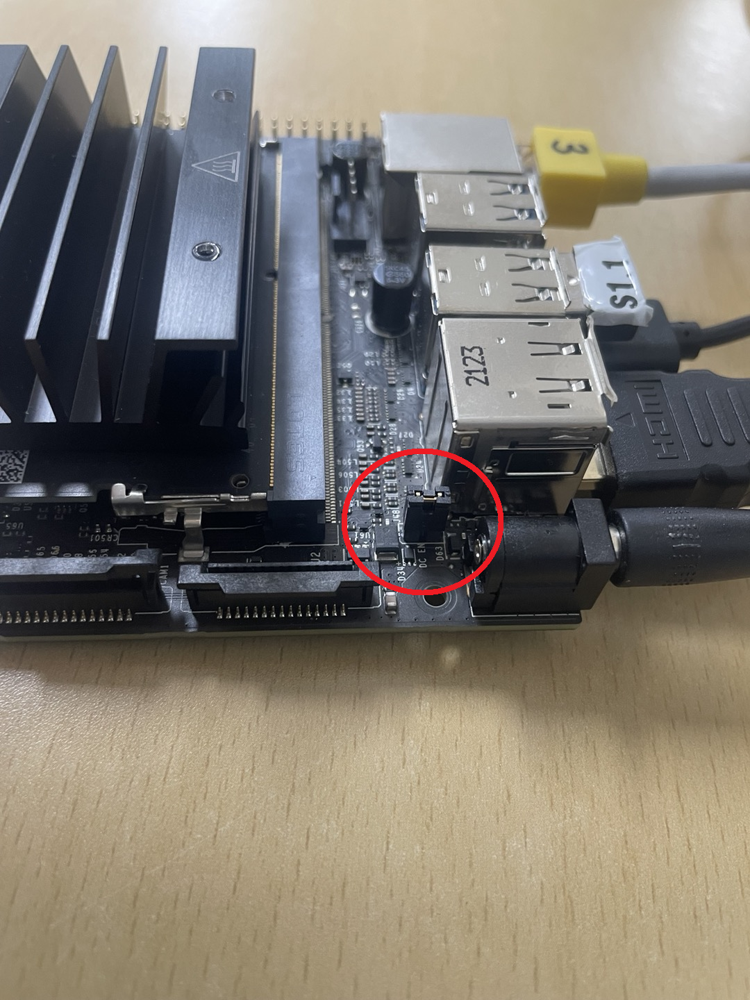
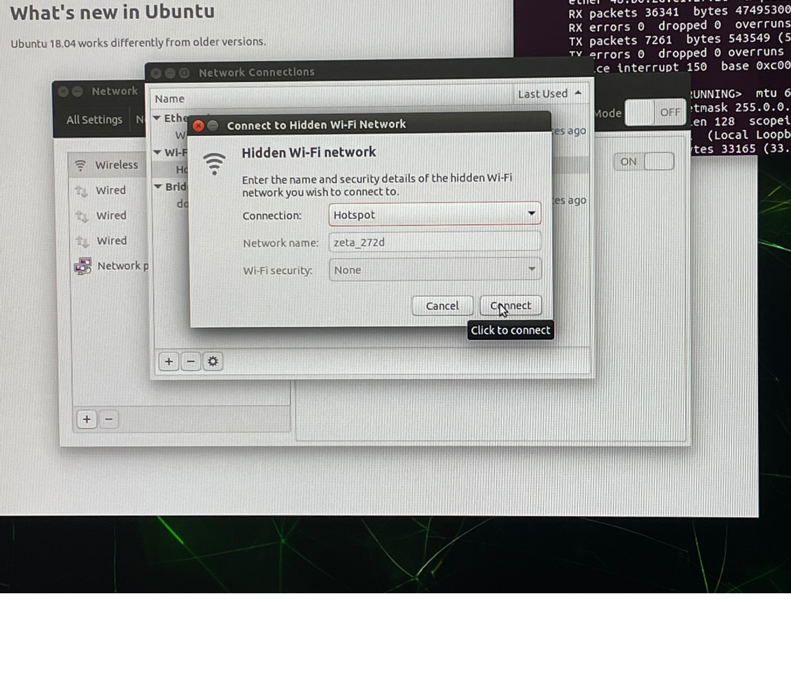

Board 세팅
==========

**목표:** Jetson-Nano Developer Kit Board를 세팅합니다.

사전준비
--------

1. WiFi 모듈과 안테나

2. Jetson-Nano Developer Board

3. 랜선, HDMI, SD카드, 키보드, 마우스, 스피커, 카메라, 전원 (5V/4A MAX)

4. 큰 드라이버, 작은 드라이버 각각 1개씩

Board 세팅
^^^^^^^^^^^^^^^^^^^^^^^^^^^^^^^^^^^

Jetson-Nano Board를 세팅합니다.

1. 와이파이 모듈 연결
~~~~~~~~~~~~~~~~~~~

와이파이 모듈을 연결합니다.
단, 와이파이 모듈의 선을 아래로 향하게 합니다.

.. image:: images/wifi_module.png

2. 보드 연결
~~~~~~~~~~~

- SD 카드
- 전원선 (5V/4A)
- HDMI
- 키보드/마우스
- 스피커
- LAN 선

모두 연결합니다.

* 주의: 점퍼를 연결해야 전원선으로 전원공급 가능해진다.

화면이 나오면 세팅 시작합니다.

3. Wifi 세팅
~~~~~~~~~~~

모두 Continue를 선택하고 계정 설정시, 아래와 같이 입력합니다.

name: zeta

pw: 1

Login Automatically 체크 

최대출력 MAXN

3.1 Hotspot 설정
~~~~~~~~~~~~~~~~

1. Search(Win키) 

2. network 

3. Use as Hotspot 

4. Turn On

5. Edit Connection

6. Hotspot 더블 클릭 

7. Mode: Hotspot으로 변경 

8. ssid 변경 (zeta_XXXX) 

      - ethernet의 MAC address 끝 4자리 (ifconfig 명령어로 확인 가능)

9. General 탭에서 Automatically connect 체크

10. Save

11. 다시 Hotspot 더블클릭

12. Wi-Fi Security 탭 진입

13. Security: WPA & WPA2 Personal

14. PW: 12345678

15. Save

16. Connect to Hidden Wi-Fi Network 선택

17. Hotspot으로 설정한 뒤 Connect를 선택

18. Wi-Fi 세팅 완료

4. ssh 원격접속
~~~~~~~~~~~

1. Jetson-Nano의 ip주소 확인하고 ssh 원격접속 시작

2. ZetaBank GitHub에 접속 후 안내에 따라 진행

      - GitHub[zetabank-rm/docker]: https://github.com/zetabank-rm/docker/

      - 버전에 따라 branch를 선택 (ex. 개발 버전이면 ``bulk``)

      - ``usage`` 부분의 3번부터 진행

      - GitHub Access Token을 발행

            Settings - Developer settings - Personal access tokens - Tokens(classic) - Generate new token(classic) - Expiration을 ``No expiration``으로 설정 - Select scopes 모두 체크 - Generate token

            <Access token은 ``Docker clone``을 진행할 때 pw로 입력>

요약
-------

Jetson-Nano Board를 세팅하기 위해 Wifi 모듈을 이용해 Hotspot 활성화 및 원격 접속을 진행하였습니다.

