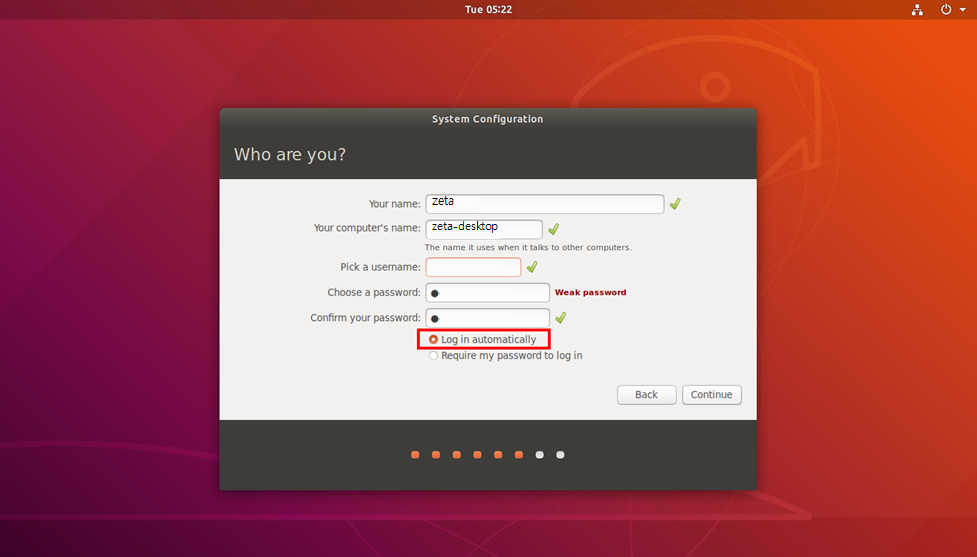

Board 세팅
==========

**목표:** Jetson-Nano Developer Kit Board를 세팅합니다.

사전준비
--------

1. WiFi 모듈과 안테나

2. Jetson-Nano Developer Board

3. 랜선, HDMI, SD카드, 키보드, 마우스, 스피커, 카메라, 전원 (5V/4A MAX)

4. 큰 드라이버, 작은 드라이버 각각 1개씩

.. list-table::
    :header-rows: 1

    * - Product Picture
      - Product Description
    * - |part_1|
      - | Jetson-Nano Developer Kit
    * - |part_2|
      - | WiFi 모듈과 안테나
    * - |part_3|
      - | 랜선, HDMI, 키보드, 마우스, 스피커, 전원 (5V/4A MAX)
    * - |part_4|
      - | 큰 드라이버, 작은드라이버
      

와이파이 모듈 연결
---------------------

와이파이 모듈을 연결합니다.
단, 와이파이 모듈의 **선** 을 다음과 같이 향하게 합니다.

보드 연결
---------------------

- SD 카드
- wifi 안테나
- 전원선 (5V/4A)
- HDMI
- 키보드/마우스
- 스피커
- LAN 선

**모두** 연결합니다.

* 주의: 아래와 같이 점퍼를 연결해야 전원선으로 전원공급 가능해진다.

Wifi 세팅
---------------------

1. 시스템 설정
~~~~~~~~~~~~~~~~~~~~

모두 Continue를 선택하고 계정 설정시, 다음과 같이 입력합니다.

* name: zeta
* pw: 1
* Login Automatically 체크 

최대출력 MAXN (60891)

2. Hotspot 설정
~~~~~~~~~~~~~~~~~~~~

Search(Win키) - network 선택한다.

Use as Hotspot 선택한다.

.. image:: images/board_setting/use_as_hotspot.png

Turn On을 누른다.

Edit Connection을 클릭한다.

Hotspot 더블 클릭한다. 

Mode를 Hotspot으로 변경한다.

ssid 변경한다. (zeta_XXXX)  - ethernet의 MAC address 끝 4자리 (ifconfig 명령어로 확인 가능)

General 탭에서 Automatically connect 체크한다.

Save하고 다시 Hotspot 더블클릭

Wi-Fi Security 탭 진입하고, ``WPA & WPA2 Personal`` 선택 후, 패스워드: **12345678** 설정

마지막으로 Save하면 Hotspot이 활성화 된다. 따라서 우리는 지금까지 설정시킨 Hotspot을 사용해야한다.

Connect to Hidden Wi-Fi Network 선택한다.

Hotspot으로 설정한 뒤 Connect를 선택한다.

그렇다면 최종적으로 Wi-Fi 세팅 완료된 것이다.

ssh 원격접속
-------------------

Jetson-Nano의 **ip주소** 확인하고 ssh 원격접속 시작한다.

GitHub ``Access Token`` 을 발행한다.

우측 위 계정 아이콘을 클릭하여 setting에 진입한다.

.. image:: images/board_setting/github_setting.png

왼쪽 제일 하단에 developer setting에 진입한다.

Generate New Tokens을 클릭하여 classic을 선택한다.

만료일은 없이 설정한다. 앞으로도 사용하기 위함이다.

모든 scope를 선택하고, token을 생성한다. 생성된 token의 key를 잘 저장해두었다가 ``Docker clone``을 진행할 때 pw로 입력한다.

ZetaBank GitHub에 접속 후 안내에 따라 진행한다. (https://github.com/zetabank-rm/docker/)

      - 버전에 따라 branch를 선택 (ex. 개발 버전이면 ``bulk``)

      - ``usage`` 부분의 3번부터 진행

요약
-------

Jetson-Nano Board를 세팅하기 위해 Wifi 모듈을 이용해 Hotspot 활성화 및 원격 접속을 진행하였습니다.

